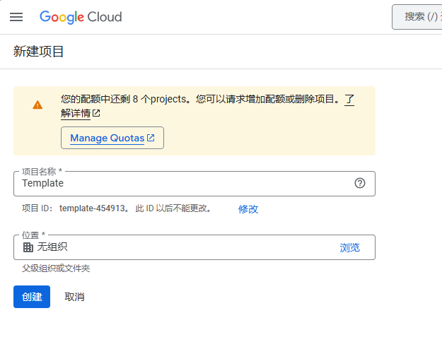
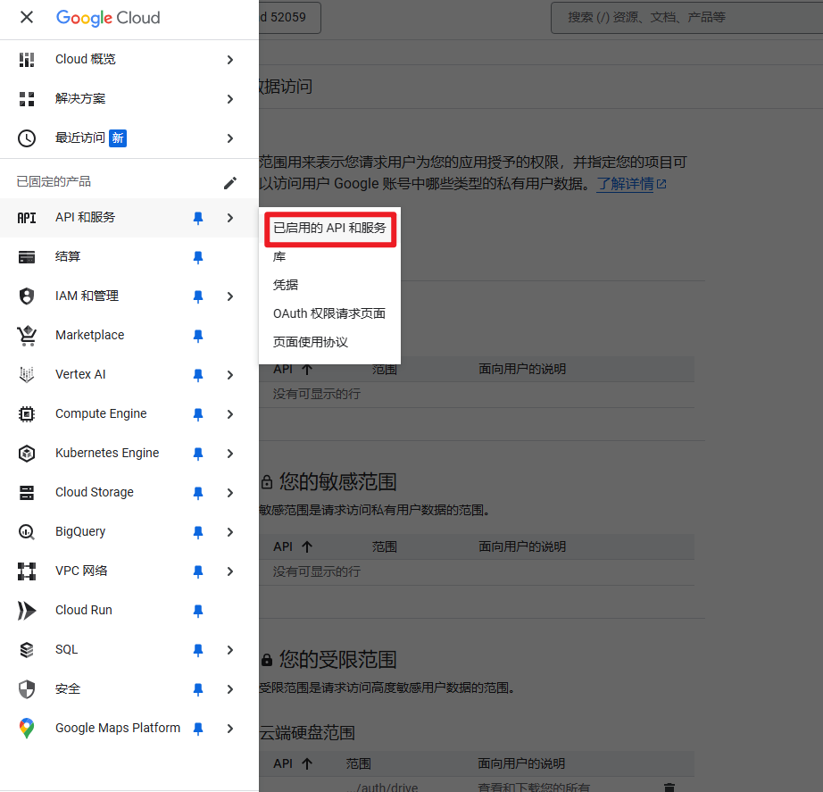
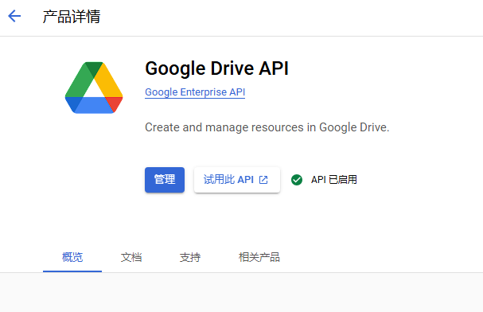
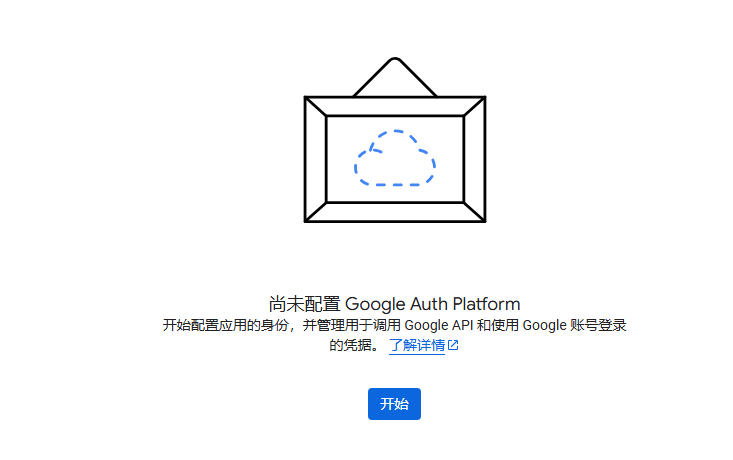
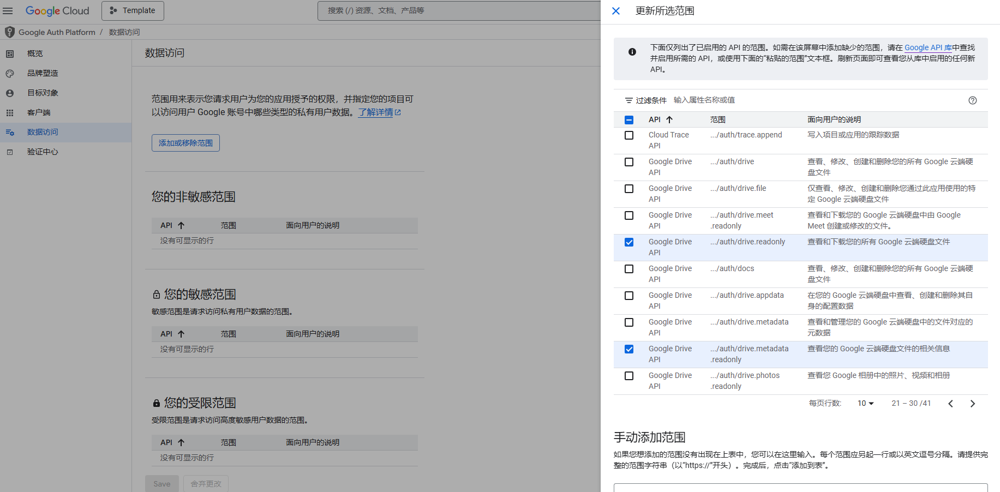
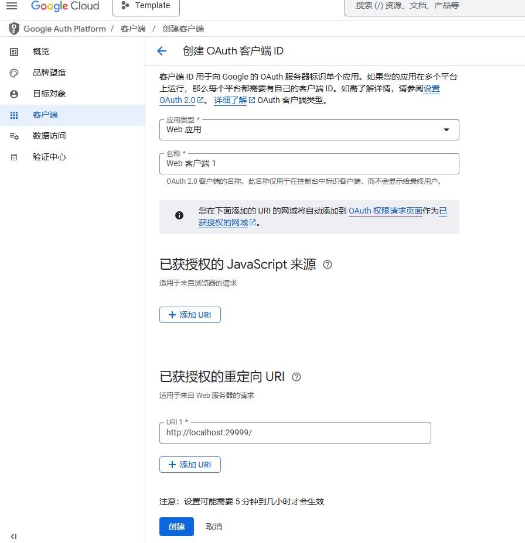

# Google Drive Downloader 2025-03

利用 Google Drive API 实现的 Python 下载脚本

## 配置Drive应用

1. 登入[谷歌云控制台](https://console.cloud.google.com/)

2. 创建新项目

    


3. 添加google drive api

    API和服务->已启用的API和服务->添加新的API

    

    搜索Google Drive API，并将其启动

    

4. OAuth初始化

    API和服务->OAuth权限请求页面

    用户对象选择“外部”，名称邮箱随意填写即可

    

5. 添加数据访问权限

    OAuth权限请求页面->数据访问->添加或移除范围(Domain)

    需要勾选 drive.metadata.readonly 和 drive.readonly，然后更新

    

6. 添加用户

    OAuth权限请求页面->目标对象->Add Users

    填写你的 Google Drive 账户邮箱

7. 创建客户端

    OAuth权限请求页面->客户端->创建客户端

    重定向URI输入：`http://localhost:29999/`

    （该端口号可以更改，和代码中的`PORT`一致即可）

    

    创建后，即可下载该客户端的json格式证书

    该证书文件路径对应代码中的 `credentials_path` 字段

## 获取文件ID

从Google Drive上获取的链接格式如下：

`https://drive.google.com/file/d/{FILE_ID}/view?usp=drive_link`

其中`FILE_ID`填入代码中的`file_id`字段即可

## 开始下载

设定好`save_dir`和代理后，即可开始下载

```
pip install -r requirement.txt
```

```
python download.py
```

初次运行会弹出链接提示进行授权，后续运行则不需要授权